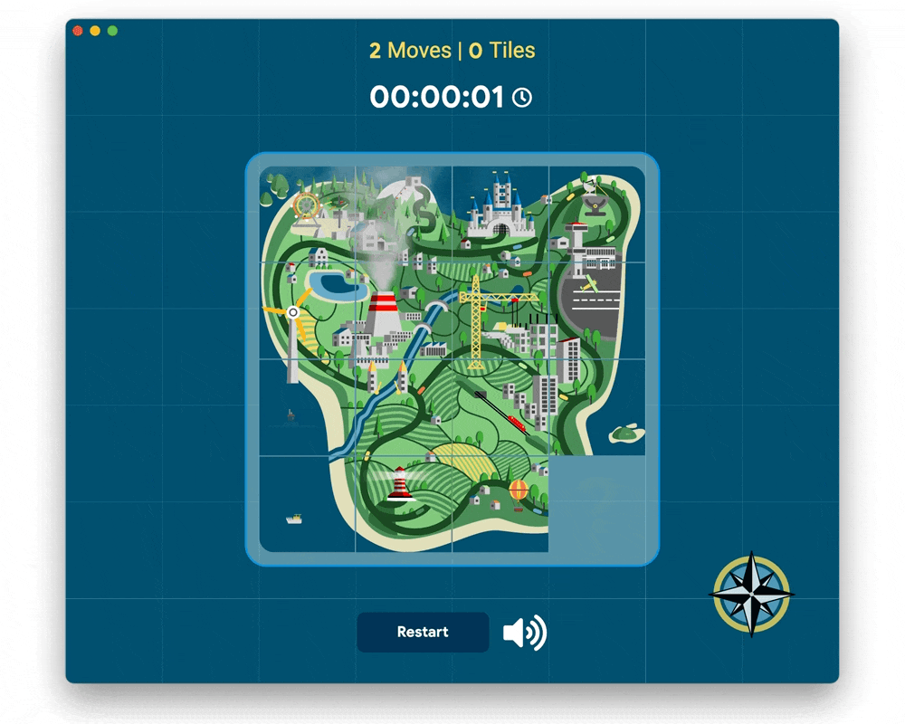

# Map Slide Puzzle

[](https://vimeo.com/tsinis/map-slide-puzzle)

[![License: MIT][license_badge]][license_link]
[](https://github.com/tsinis/slide_puzzle/releases)
[](https://codemagic.io/apps/62254e583ce15d170e3b522d/62254e583ce15d170e3b522c/latest_build)
[](https://github.com/tsinis/slide_puzzle/actions/workflows/deploy.yaml)
[](https://github.com/tsinis/slide_puzzle/actions/workflows/tests.yaml)
[](https://codecov.io/gh/tsinis/slide_puzzle)


## Table of content

* [Description](#Description)
* [Getting Started](#Getting-Started)
  * [Platform Specific Setup](#Platform-Specific-Setup)
* [Tests](#Tests)
* [Accessibility](#Accessibility)
* [Licenses](#Licenses)
* [Working with Translations](#Working-with-Translations)
  * [Adding Strings](#Adding-Strings)
  * [Adding Supported Locales](#Adding-Supported-Locales)
  * [Adding Translations](#Adding-Translations)

## Description

A slide puzzle built for [Flutter Challenge](https://flutterhack.devpost.com/).

*This is a heavily modified version of the sample project provided as a starting point of this challenge (Built by [Very Good Ventures][very_good_ventures_link] in partnership with Google.). Modified by [Roman Cinis][roman_cinis_link].*

Your **goal is to assemble the map of the island with a treasure**, which will be displayed after the 15 tiles are correctly placed. Each tile contains its unique, handcrafted location and animation. The **whole design is created in vector graphics**, so there are no raster images in the game at all. You can zoom in on the tiles (mouse wheel on desktop and macOS and pinch gesture on mobile). **The game works on all platforms that Flutter offers**.

> Flutter and the related logo are trademarks of Google LLC. We are not endorsed by or affiliated with Google LLC.

## Getting Started

To run the project either use the launch configuration in VSCode/Android Studio or use the following command:

```sh
flutter pub get
flutter gen-l10n
flutter run
```

### Platform Specific Setup

You should run the the app without any additional steps on all platforms without any problems, however, for audio player in **Linux** builds you will need to install **libwebkit2gtk-4.0-dev** package first (via sudo apt-get install):

```sh
sudo apt-get update -y
sudo apt-get --assume-yes install libwebkit2gtk-4.0-dev
```

## Tests

The code is almost 100% covered by the unit/widget tests. To run all unit and widget tests use the following command:

```sh
flutter test --coverage --test-randomize-ordering-seed random
```

To view the generated coverage report you can use [lcov](https://github.com/linux-test-project/lcov).

```sh
# Generate Coverage Report
$ genhtml coverage/lcov.info -o coverage/

# Open Coverage Report
$ open coverage/index.html
```

## Accessibility

The app was originally designed to be accessible by **WCAG 2.1 AA standards at minimum, and AAA in particular**. All **texts have a contrast ratio at least of 4.5, images 3.0, touch target sizes of at least 48dp**. The game was also built to be **controllable via keyboard/input device/remote control/gamepad**.

## Licenses

This project is released under the terms of the [MIT license](./LICENSE). All assets (as sounds, fonts) licensed and are free for personal use. You can find **LICENSE** files in their folders. You can also **press on floating compass logo to show "About" dialog** and check all licenses for packages used in this game.

## Working with Translations

This project relies on [flutter_localizations][flutter_localizations_link] and follows the [official internationalization guide for Flutter][internationalization_link].

### Adding Strings

1. To add a new localizable string, open the `app_en.arb` file at `lib/l10n/arb/app_en.arb`.

```arb
{
    "@@locale": "en",
    "counterAppBarTitle": "Counter",
    "@counterAppBarTitle": {
        "description": "Text shown in the AppBar of the Counter Page"
    }
}
```

2. Then add a new key/value and description

```arb
{
    "@@locale": "en",
    "counterAppBarTitle": "Counter",
    "@counterAppBarTitle": {
        "description": "Text shown in the AppBar of the Counter Page"
    },
    "helloWorld": "Hello World",
    "@helloWorld": {
        "description": "Hello World Text"
    }
}
```

3. Use the new string

```dart
import 'package:map_slide_puzzle/l10n/l10n.dart';

@override
Widget build(BuildContext context) {
  final l10n = context.l10n;
  return Text(l10n.helloWorld);
}
```

### Adding Supported Locales

Update the `CFBundleLocalizations` array in the `Info.plist` at `ios/Runner/Info.plist` to include the new locale.

```xml
    ...

    <key>CFBundleLocalizations</key>
	<array>
		<string>en</string>
		<string>es</string>
	</array>

    ...
```

### Adding Translations

1. For each supported locale, add a new ARB file in `lib/l10n/arb`.

```
├── l10n
│   ├── arb
│   │   ├── app_en.arb
│   │   └── app_es.arb
```

2. Add the translated strings to each `.arb` file:

`app_en.arb`

```arb
{
    "@@locale": "en",
    "counterAppBarTitle": "Counter",
    "@counterAppBarTitle": {
        "description": "Text shown in the AppBar of the Counter Page"
    }
}
```

`app_es.arb`

```arb
{
    "@@locale": "es",
    "counterAppBarTitle": "Contador",
    "@counterAppBarTitle": {
        "description": "Texto mostrado en la AppBar de la página del contador"
    }
}
```

[flutter_localizations_link]: https://api.flutter.dev/flutter/flutter_localizations/flutter_localizations-library.html
[internationalization_link]: https://flutter.dev/docs/development/accessibility-and-localization/internationalization
[license_badge]: https://img.shields.io/badge/license-MIT-yellow.svg
[license_link]: https://opensource.org/licenses/MIT
[roman_cinis_link]: https://github.com/tsinis
[very_good_ventures_link]: https://verygood.ventures/
